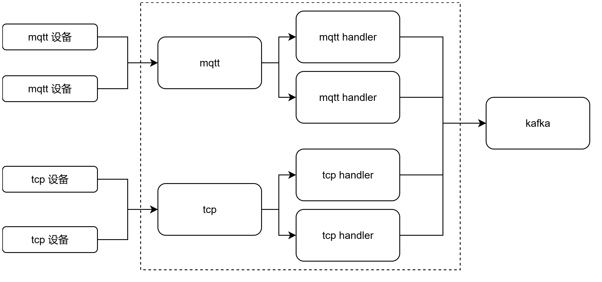

# 云端网关介绍

## 概述
对于直连到平台的设备，所有协议，通过物联网平台的网关进行数据转换和处理，以标准数据格式发送至平台服务。
## 设计思路

### 数据上报
对于物联网平台的网关，我们需要满足不同协议的处理逻辑。那么我们需要为每种协议提供一个通道，例如tcp协议，我们提供一个通道用于处理tcp协议，但是不同类型的设备虽然都是通过TCP协议进行上报的 ，但是编解码方式却都不一样，所以，我们通过不同的实现类来进行处理。
### 指令下发
平台侧下发指令，需要找到对应的通道，以及对应产品物模型协议的实现类，所以，我们将处理实现类和productKey做好映射，通过productKey找到对应的实现类，调用其中的发送指令方法。

## 处理逻辑
所有的处理实现类都实现接口  `com.trionesdev.phecda.gateway.core.GatewayHandler`  
对于不同协议的处理，我们引入对应协议的jar包。继承对应的抽象函数，实现 其中的匹配逻辑和处理逻辑。
> handlers包中是kotlin开发的

```kotlin
interface GatewayHandler {
    fun postProperties(properties: PhecdaEvent)
    fun postEvents(properties: PhecdaEvent)
    fun sendCommand(command: PhecdaCommand)
}
```
## GatewayHandlerComponent注解
注解用来标记网关处理器，@GatewayHandlerComponent(productKeys = {"mqtt1"})  ，工程启动的时候，会去扫描这个注解，根据productKeys将对应的处理器和productKey形成mapping。如果不加该注解，将无法被扫描到，不配置 productKeys 属性，则无法下发指令。

## 默认处理逻辑
如果设备端能直接上报满足平台数据格式的协议，那么便无需特殊处理，每种协议，我们都提供了默认处理以适配Phecda默认的数据格式。以Mqtt为例，在mqtt process的jar包中，定义了一个 PhecdaMqttGatewayHandler 类，对符合平台数据标准的进行处理。我们只需要继承对应的类，并加上相关注解即可。
```kotlin
@GatewayHandlerComponent(productKeys = {"p1","p2"})
public class PhecdaDefaultMqttGatewayProcessor extends PhecdaMqttGatewayProcessor {
}
```
