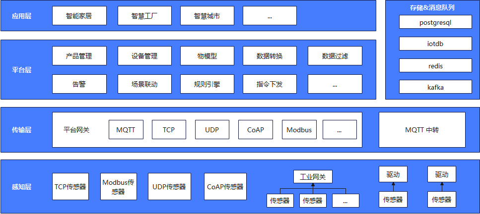

# 快速开始

## 概述

本平台设计目标是为了满足设备传感数据和业务系统之间的解耦，感知设备数据，通过本平台收集处理之后发送给业务系统，业务系统专注于业务即可。平台自身提供了设备的管理，数据的展示等基础功能。

## 架构设计

## 层级划分

* 感知层： 感知层主要负责将传感器数据进行上报，传感器上报数据，根据传感器设备的特性，主要分为 驱动模式，工业网关模式，直连模式

| 模式     | 场景描述                                                         |
|:-------|:-------------------------------------------------------------|
| 驱动模式   | 对于通过动态链接库的方式进行通信的设备，需要通过驱动模式，集成动态链接库，与设备进行通信，通过驱动应用，将数据进行上报。 |
| 工业网关模式 | 对于zigbee,RoLa等短距传输协议，或者其他非网络通信协议，通过工业网关，将数据转换并进行上报。          |
| 直连模式   | 可以通过物联网卡进行数据上报。                                              |

* 传输层：对于数据上传模式，驱动模式，我们统一通过mqtt 进行上报，非驱动模式，可以通过网关进行接入。
* 平台层：传输层接收到设备数据后，平台层进行消费。平台提供了规则引擎，可以对数据进行场景联动，并且通过对应的topic进行消息转发，供给业务侧进行消费。
* 应用层：业务侧应用

## 技术实现
* 平台服务端：主体基于java Spring Boot开发，mybtis-plus作为ORM组件，reasy-rule 规则引擎，disruptor高性能队列
* 平台前端：前端使用react框架，antd UI组件库，antv图表库
* 数据库：关系型数据库postgresql, 时序数据库 iotdb
* 消息队列：设备侧 mqtt, 内部 kafka
* 网关：基于spring web flux 的异步编程
* 直连驱动：驱动提供多语言版本，java,c#,c++,golang,python等

